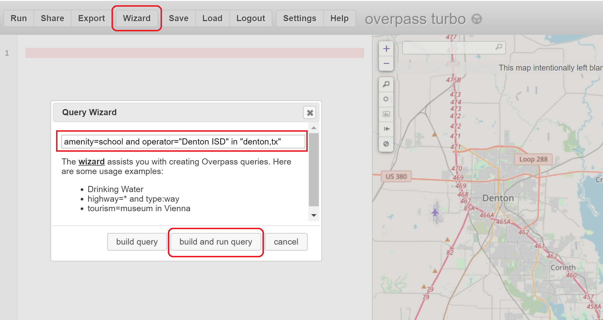
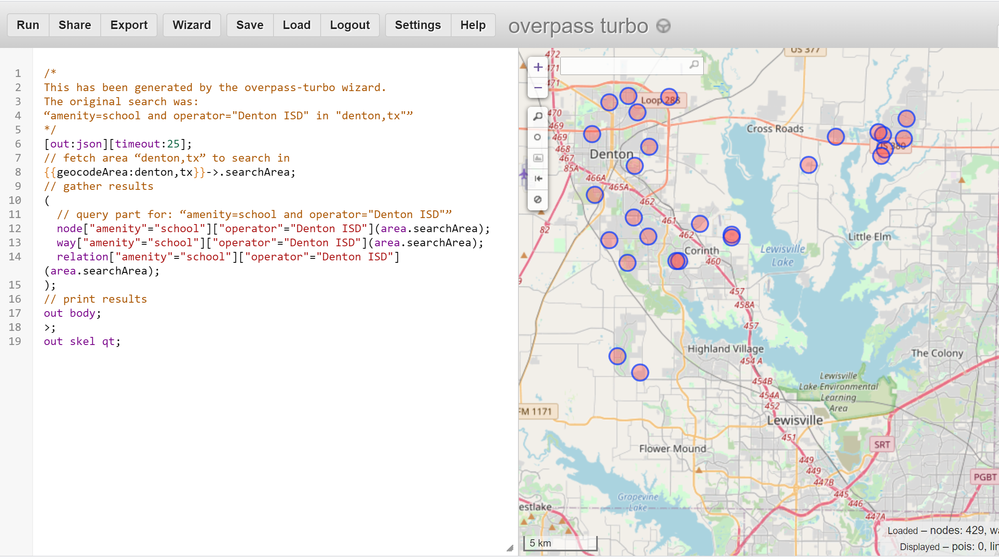
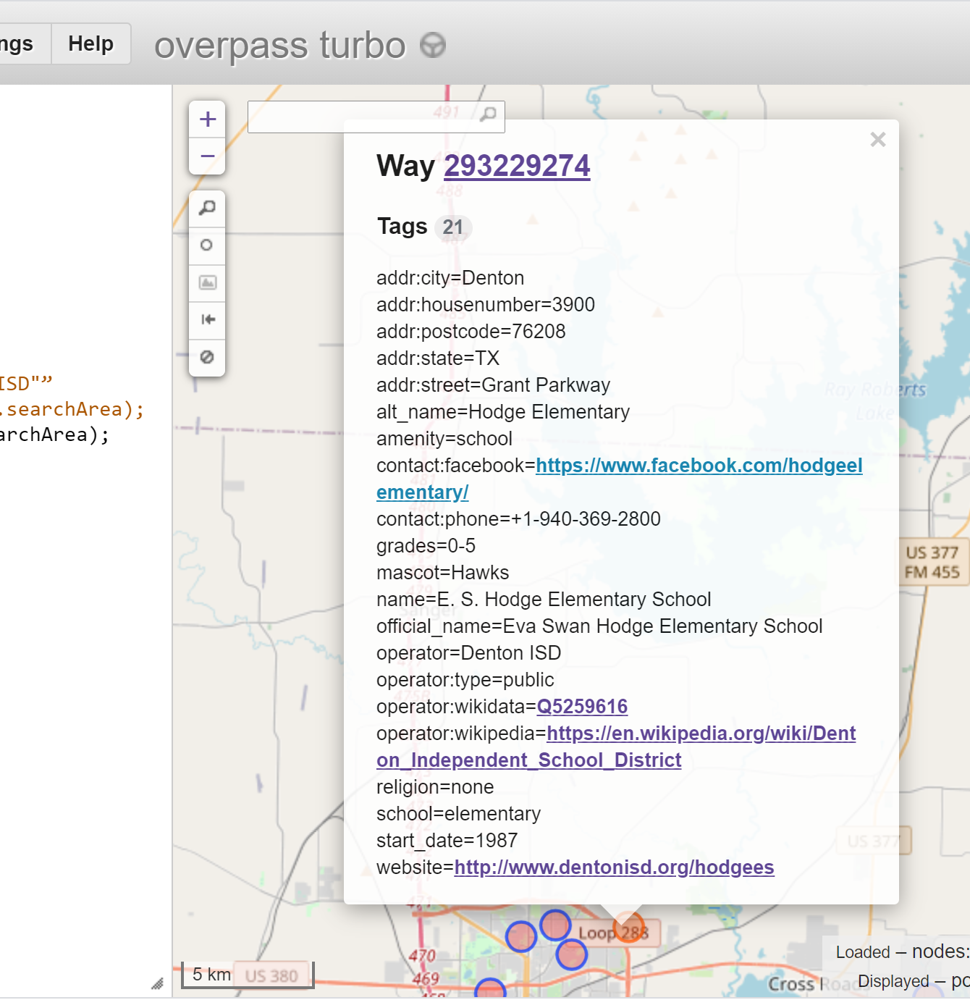
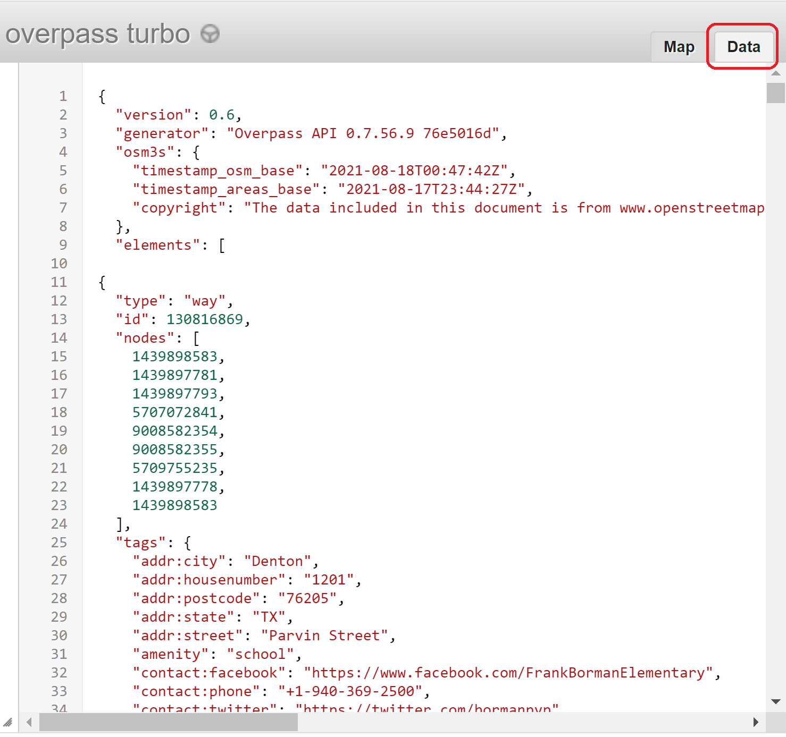
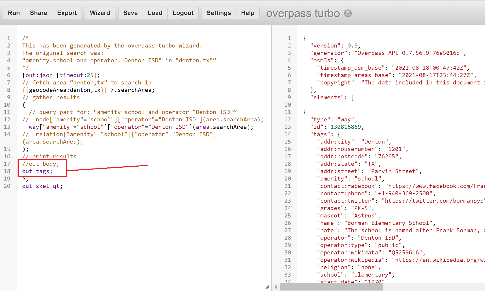
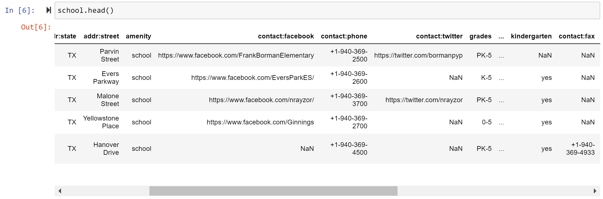
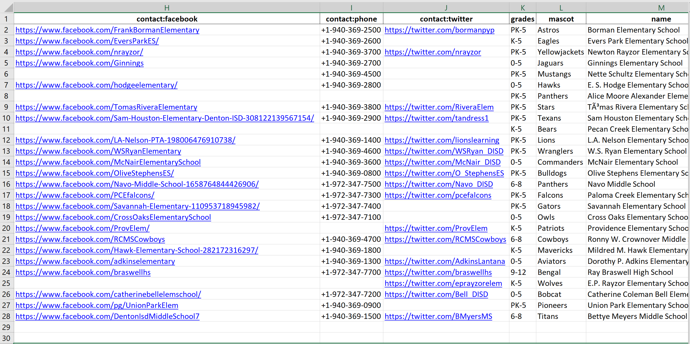

In this post I am documenting how I exported OpenStreetMap (OSM) data into a Python dataframe for inspection. The use case for this task is the following: in OSM I have added all the schools in my area along with a list of tags. Because it took a couple days and I evolved the process along the way, I’m not confident that the tags are consistent or completely accurate. To audit in OSM is difficult because I would need to select each school, then scroll through and maybe take a screenshot...it’s just a mess. Having all the data in a tabular format would just be super efficient. 

Here is an example of the value/keys or “tag data” assigned to a particular elementary school. Notice there are 21 different tags, but this is not a set value, it could be a different number for a different school. 


## Overpass-Turbo

First of all, there are different OSM tools depending on what you want to do. For example, the most popular and diverse is rendering data. There are dozens of different apps and websites that do this. The most generic is https://www.openstreetmap.org/. Then, if you want to add or edit data within the OSM database you can use web-based iD, JOSM, various apps, etc. If you want to query data, there are libraries for your favorite language, but the only method that I have any workable knowledge with is the web-based https://overpass-turbo.eu/. 

With Overpass-Turbo is a front-end to the Overpass API and has a query-wizard which makes it quite beginner friendly.  

### Query Your Data

There are plenty of tutorials on using overpass-turbo, including the [wiki](https://wiki.openstreetmap.org/wiki/Overpass_turbo), but as a very quick primer...

You can create a query via the wizard by clicking “Wizard”, enter your string query, then ( click “build query” and “Run”) or ( click “build and run query”).  



The query language is [Overpass QL](https://wiki.openstreetmap.org/wiki/Overpass_API/Language_Guide) and the wizard-generated query is on the left panel and the map or data results are on the right panel. 



The map results are the actual shape but in zoomed out revert to a circle. If you click on the result it shows you all the tags, as shown below. 



On the right-hand panel, you can also click the “Data” tab to see the JSON data of the results.



### Save The Results

But! What we ultimately want is just the data under “tags” for each result. There are a plethora of options, like outputting to csv, json, xml or filtering the output to specific fields. The easiest (for me) for this use-case is to simply filter the output to just show the “tags”. 

To begin with, I commented out the nodes and relations because I only want the ways. The next step is to replace `out body;` with `out tags;`. “tags” is a prebuilt key that outputs all the tags.  See the difference of output in the right-hand panel. To complete this step, save the file.



## Python to the Rescue

Python can be used to read the json file into a dataframe. I’m not convinced this is the most pythonic or efficient code, but it works.

```python
import json
import pandas as pd

data = json.load(open('schools.json')) # Read turbo-overpass output file

# This is a bit hacky... I need to pull out the second-level data
tempdf = pd.DataFrame(data["elements"])
df = tempdf.loc[:, ["tags"]]

school = pd.DataFrame()
for index, row in df.iterrows():
    test1 = pd.DataFrame(row['tags'], index=[0])
    school = pd.concat([school,test1])

school.head() # Let's look at it
school.to_excel("output.xlsx") # Send it to an Excel sheet
```

For this I used a [Jupyter Notebook](https://jupyter.org/). Here is my output.



This already is awesome! I can clearly see that the school on the bottom does not have a Facebook page, but for some ungodly reason has a fax number. What is even cooler is that I slipped in code to export all this to Excel. Check out the last line of the code above. 



This is the final result. From here I can sort, filter, and search. For example, all schools should have a phone number, so I can identify those that do not easily and add it.